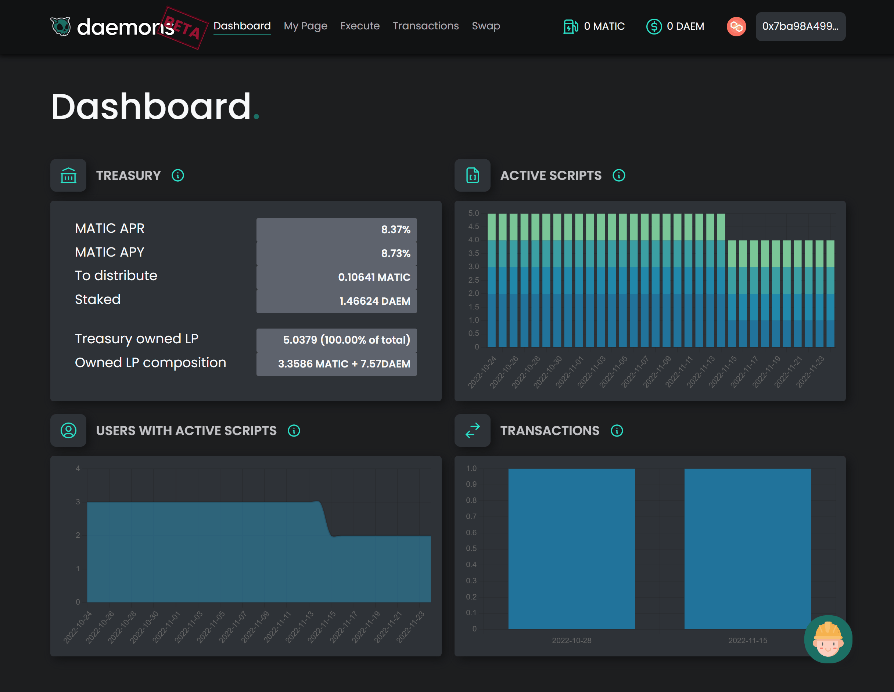

Microservices

Packages:

# Daemons Finance

An environment in which users can **script operations on the blockchain and have them automatically executed** with a certain frequency or when a condition becomes true.

## Some examples

Daemons scripts include multiple conditions and actions and look like this:

- Once a week => Swap 500 DAI for wBTC
- When price of wBTC > 4300$ => Swap 2000 DAI for wBTC
- When BTC > 0 in my wallet => Send to wallet 0x123456..
- When price of sOHM < 3000$ => Unstake sOHM => Send sOHM to wallet 0x123 => Swap 100% of sOHM for DAI
- ...

## How to run

All the projects:

- `npm install` to install the dependencies

### Backend

The backend directory contains the Solidity contracts behind the platform.

- `npx hardhat compile` to compile the contracts (remember to compile before of running tests!)
- `npx hardhat run scripts/test.ts --network testnet` to run scripts

### Frontend

The frontend directory contains the React code used to interact with the contracts without having a master's in Solidity.

- `npm start` to compile the typescript via webpack and run the project on port 3000

### Storage

The storage directory contains the code to interact with the MongoDB where the scripts are saved.

- `npm run dev` to run the project on port 5000

NOTE: **You need to have mongodb installed locally**

### Messages

The messages directory contains the definitions of the messages used by the other projects to communicate with each other.

### Admin

The admin directory contains tasks that will run periodically to save stats for the admin.

- `npm run dev` to run the project
